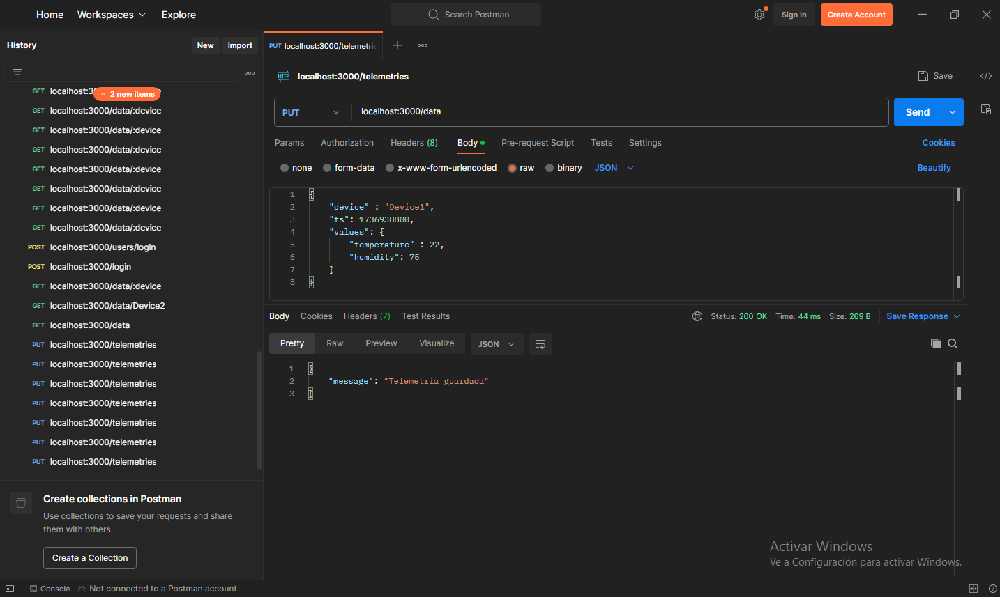
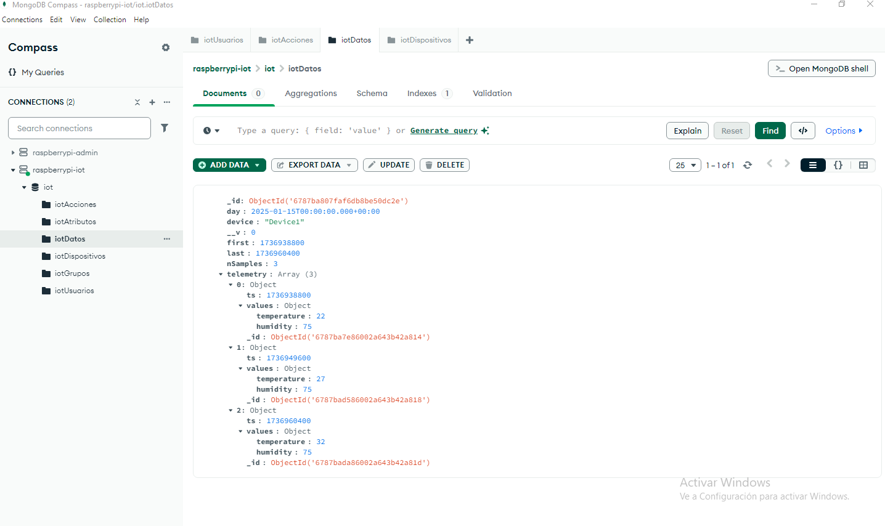
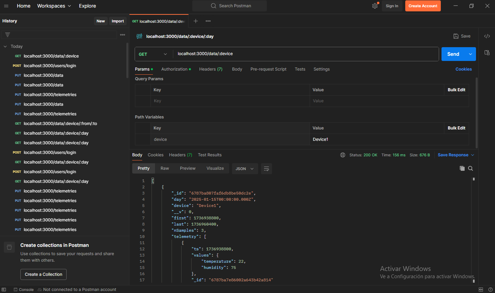
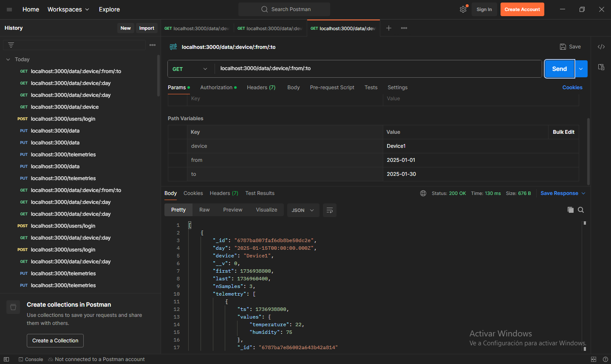
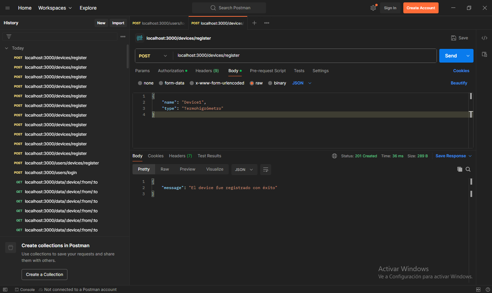
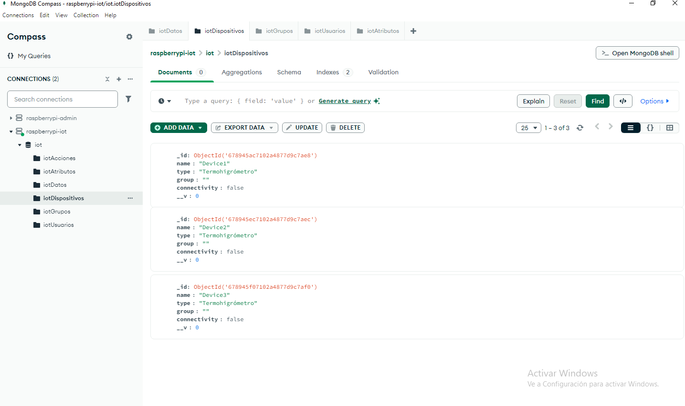
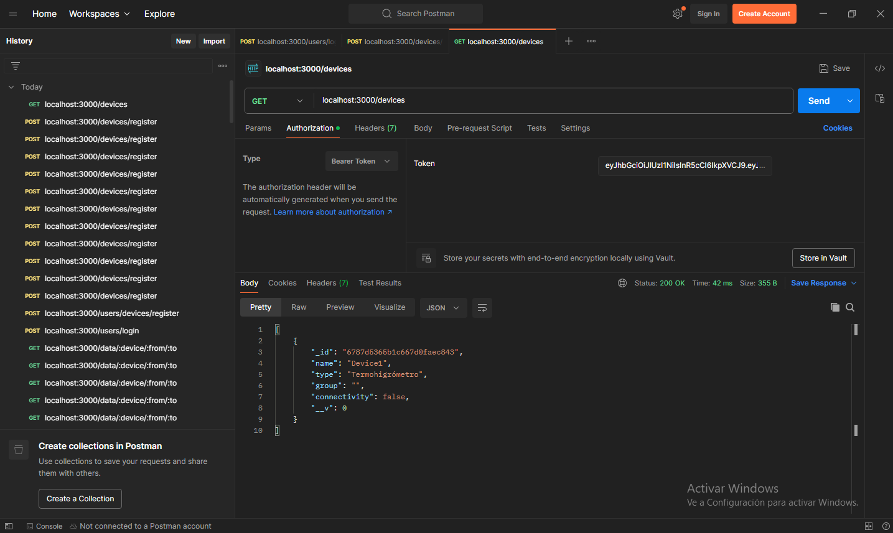
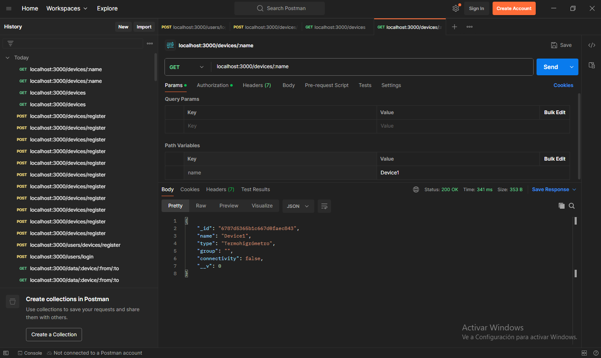
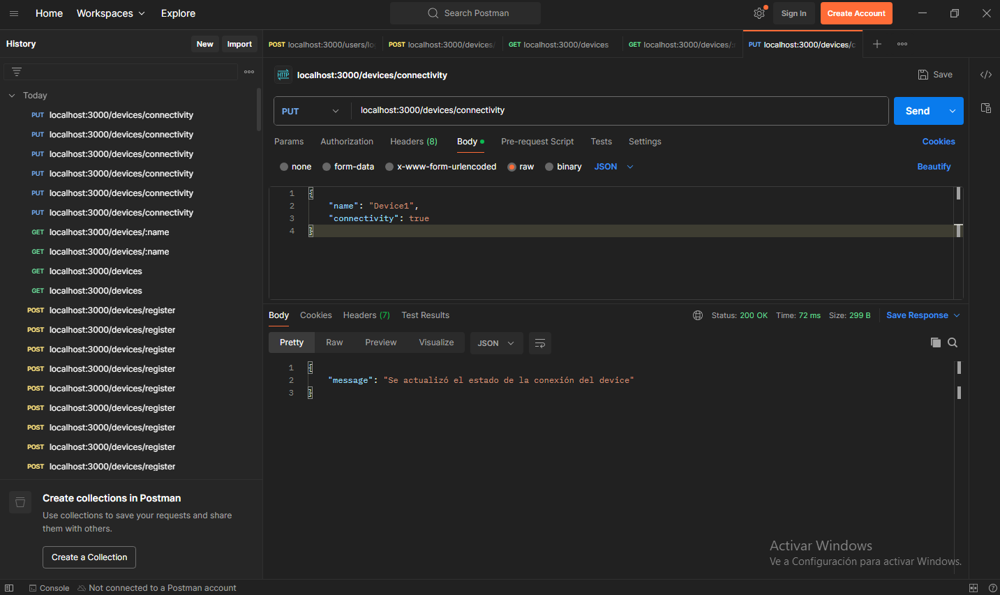

# Proyecto: Plataforma IoT para una Raspberry Pi 3 B+

## Etapa 1: Mongo con Docker

Comandos útiles:

- `docker compose down`.
- `sudo rm -rf mongo/datadir`.
- `docker compose up --build -d`.

Prueba con MongoDB Compass:

## Etapa2: API REST para Mongo

### Gestión de los usuarios

### Gestión de los datos

📝TODO: Crear una ruta para obtener la ultima telemetría de un dispositivo.

### Gestión de los dispositivos

📝TODO: Proteger rutas de la etapa 3 comprobando que el dispositivo exista.

📝TODO: Crear una ruta para actualizar el grupo.