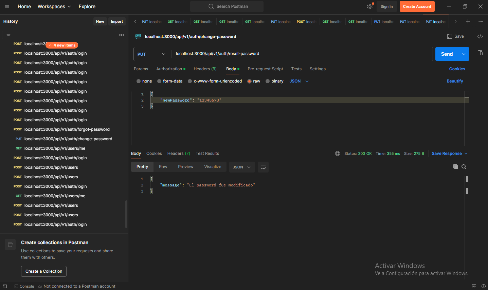
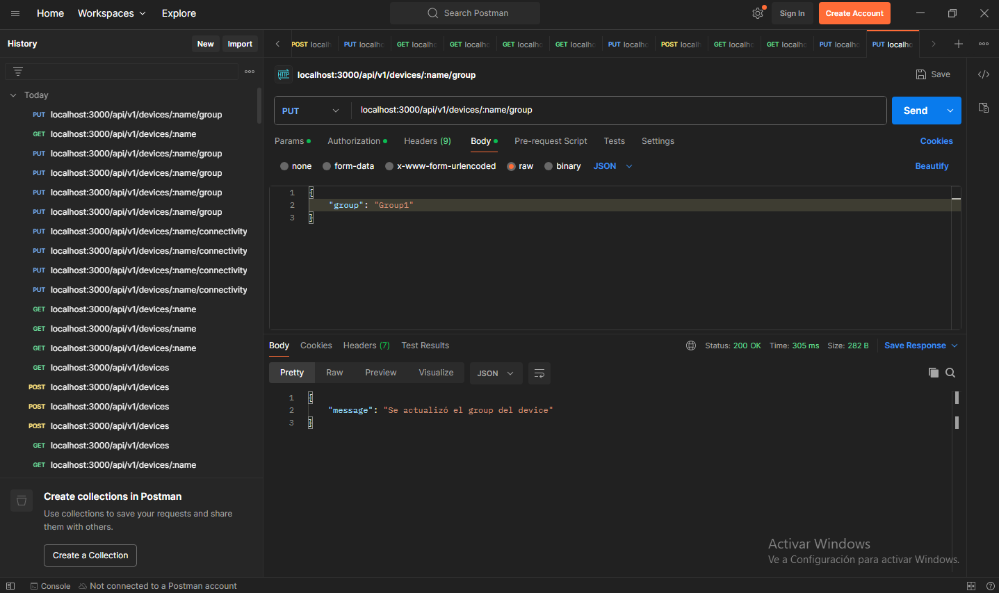

# Proyecto: Plataforma IoT para una Raspberry Pi 3 B+

## Etapa 1: Mongo con Docker

Comandos útiles:

- `docker compose down`.
- `sudo rm -rf mongo/datadir`.
- `docker compose up --build -d`.

Prueba con MongoDB Compass:

## Etapa2: API REST para Mongo

### Gestión de los usuarios

📝TODO: Las últimas 3 imágenes no están actualizadas.

### Gestión de los datos

### Gestión de los dispositivos

📝TODO: Proteger rutas que se utilizan en la etapa3 con Nginx para que no sean accesibles externamente.